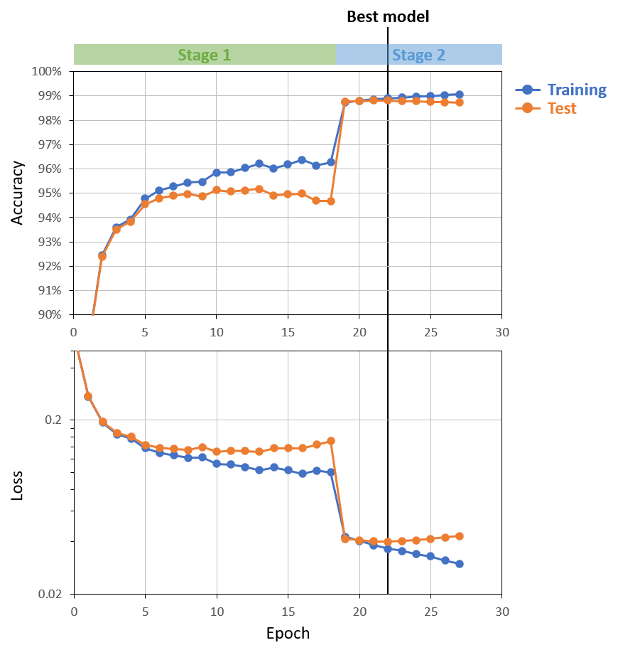

# LSTM DNA
**LSTM model for DNA feature prediction**

In this project I implemented an LSTM model to predict protein coding sequences (CDS) of bacterial genomes.

## Model Architecture

| Model |Input size| Hidden layer(s) | Hidden size(s)  | Output size |
|-------|----------|-----------------|-----------------|-------------|
| 1     | 4        | 1               | 64              | 1           |
| 2     | 4        | 1               | 128             | 1           |
| 3     | 4        | 2               | 128, 64         | 1           |

## Data

15 genomes:

| Accession | Description |
|---|---|
| NC_000913 | Escherichia coli str. K-12 substr. MG1655, complete genome. |
| NC_002505 | Vibrio cholerae O1 biovar El Tor str. N16961 chromosome I, complete sequence. |
| NC_002516 | Pseudomonas aeruginosa PAO1, complete genome. |
| NC_003098 | Streptococcus pneumoniae R6, complete sequence. |
| NC_004668 | Enterococcus faecalis V583, complete sequence. |
| NC_000915 | Helicobacter pylori 26695, complete sequence. |
| NC_000964 | Bacillus subtilis subsp. subtilis str. 168 complete genome. |
| NC_009089 | Clostridioides difficile 630, complete genome. |
| NC_010729 | Porphyromonas gingivalis ATCC 33277, complete sequence. |
| NC_007795 | Staphylococcus aureus subsp. aureus NCTC 8325 chromosome, complete genome. |
| NC_000962 | Mycobacterium tuberculosis H37Rv, complete genome. |
| NC_003198 | Salmonella enterica subsp. enterica serovar Typhi str. CT18, complete genome. |
| NC_003888 | Streptomyces coelicolor A3(2) chromosome, complete genome. |
| NC_016845 | Klebsiella pneumoniae subsp. pneumoniae HS11286 chromosome, complete genome. |
| NZ_CP009257 | Acinetobacter baumannii strain AB30 chromosome, complete genome. |

For input, each nucleotide is converted to a one-hot encoding vector of 4 elements.
For output, the label for each nucleotide is binary, where 1 is CDS and 0 is non-CDS.
For each genome, forward and reverse strands were encoded separately and concatenated.
All 15 genomes were concatenated as a super-genome sequence,
which is divided into smaller segments, i.e. samples.
Samples were then shuffled and split into training and test sets before model training.

## Training

Due to vanishing and exploding gradients and performance consideration,
training an LSTM model on the full genome as the input sequence is not possible.
The full genome sequence is divided into segments of sequences,
where each segment is deemed as a "sample".
The length of each segment is fixed as the input sequence length, or `seq_len`.

Initially the model was trained on a short input sequence length (`seq_len=128`) for easier convergence.
Shorter sequence has less problem in vanishing and exploding gradients,
and also allows more parallelization under fixed amount of GPU memory.
After the initial stage of training, the model was then trained on longer sequences (`seq_len=1024`)
to fine-tune and capture more long-distance effects.

Summary of training stages:

| `stage` | `seq_len` | `mini_batch_size` | `learning_rate` |
|---------|-----------|-------------------|-----------------|
| `1`     | `128`     | `256`             | `1e-3`          |
| `2`     | `1024`    | `32`              | `1e-4`          |

For each stage, training was stopped at 5 consecutive epochs after the minimum test loss was achieved.
The model with the minimum test loss (i.e. the best model) was used for
the next stage of training or the final output.

Training results of different model architectures:

| Model | Hidden size(s)  | Training Loss | Training Accuracy | Test Loss | Test Accuracy |
|-------|-----------------|---------------|-------------------|-----------|---------------|
| 1     | 64              | 0.04560       | 98.64%            | 0.05117   | 98.49%        |
| 2     | 128             | 0.04480       | 98.66%            | 0.05085   | 98.53%        |
| 3     | 128, 64         | 0.03655       | 99.86%            | 0.04016   |  98.81%  |
