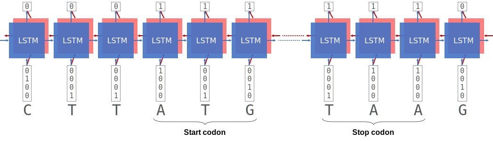

# LSTM DNA

**An LSTM model to predict protein coding sequences (CDS) of bacterial genomes**

## Model Architecture

The LSTM model in this study is a nucleotide-based, many-to-many sequence mode.
The model predicts whether each nucleotide is of CDS or not, i.e. binary classification.

**Figure 1 - Bidirectional Nucleotide-based LSTM**  
For input, each nucleotide is converted to a one-hot encoding vector of 4 elements.
For output, the label for each nucleotide is binary, where 1 is CDS and 0 is non-CDS.

**Table 1 - Model Summary**

| Model |Input size| Hidden layer(s) | Hidden size(s)  | Output size |
|-------|----------|-----------------|-----------------|-------------|
| 1     | 4        | 1               | 64              | 1           |
| 2     | 4        | 1               | 128             | 1           |
| 3     | 4        | 2               | 128, 64         | 1           |

## Data

**Table 2 - Bacterial Genomes**

|  | Accession | Description |
|---|---|---|
| 1 | NC_000913 | Escherichia coli str. K-12 substr. MG1655, complete genome. |
| 2 | NC_002505 | Vibrio cholerae O1 biovar El Tor str. N16961 chromosome I, complete sequence. |
| 3 | NC_002516 | Pseudomonas aeruginosa PAO1, complete genome. |
| 4 | NC_003098 | Streptococcus pneumoniae R6, complete sequence. |
| 5 | NC_004668 | Enterococcus faecalis V583, complete sequence. |
| 6 | NC_000915 | Helicobacter pylori 26695, complete sequence. |
| 7 | NC_000964 | Bacillus subtilis subsp. subtilis str. 168 complete genome. |
| 8 | NC_009089 | Clostridioides difficile 630, complete genome. |
| 9 | NC_010729 | Porphyromonas gingivalis ATCC 33277, complete sequence. |
| 10 | NC_007795 | Staphylococcus aureus subsp. aureus NCTC 8325 chromosome, complete genome. |
| 11 | NC_000962 | Mycobacterium tuberculosis H37Rv, complete genome. |
| 12 | NC_003198 | Salmonella enterica subsp. enterica serovar Typhi str. CT18, complete genome. |
| 13 | NC_003888 | Streptomyces coelicolor A3(2) chromosome, complete genome. |
| 14 | NC_016845 | Klebsiella pneumoniae subsp. pneumoniae HS11286 chromosome, complete genome. |
| 15 | NZ_CP009257 | Acinetobacter baumannii strain AB30 chromosome, complete genome. |

For each genome, forward and reverse strands were encoded separately for input and output data and then concatenated.
All 15 genomes were concatenated as a super-genome sequence for training and testing.

## Training

Due to vanishing and exploding gradients as well as performance consideration,
training an LSTM model on the full genome as the input sequence is not feasible.
Thus, the full genome sequence is divided into segments of sequences,
where each segment is deemed as a "sample".
The length of each segment is fixed as the input sequence length, or `seq_len`.

Initially the model was trained on a short input sequence length (`seq_len=128`) for easier convergence.
Shorter sequence has less problem in vanishing and exploding gradients,
and also allows more parallelization under fixed amount of GPU memory.
After the initial stage of training, the model was then trained on longer sequences (`seq_len=1024`)
to fine-tune and capture more long-distance effects.

**Table 3 - Summary of Training Stages**

| `stage` | `seq_len` | `mini_batch_size` | `learning_rate` |
|---------|-----------|-------------------|-----------------|
| `1`     | `128`     | `256`             | `1e-3`          |
| `2`     | `1024`    | `32`              | `1e-4`          |

For each stage, training was stopped at 5 consecutive epochs after the minimum test loss was achieved.
The model with the minimum test loss (i.e. the best model) was used for
the next stage of training, or the final output.

**Figure 2 - Learning Curve**  
The learning curve of Model #3 (128, 64 hidden units)

**Table 4 - Training Results of the Best Models**

| Model | Hidden size(s)  | Training Loss | Training Accuracy | Test Loss | Test Accuracy |
|-------|-----------------|---------------|-------------------|-----------|---------------|
| 1     | 64              | 0.04560       | 98.64%            | 0.05117   | 98.49%        |
| 2     | 128             | 0.04480       | 98.66%            | 0.05085   | 98.53%        |
| 3     | 128, 64         | 0.03655       | 99.86%            | 0.04016   |  98.81%  |

## Nucleotide-level Prediction

It is computationally inefficient and numerically unstable to run the whole genome sequence as a single forward pass.
Thus, genome sequences were divided into small segments (1024 nucleotides), predicted independently, and rejoined together.

However, at either end of each segment, predictions are inherently worse due to lack or memory and context.
To resolve this problem, predictions were made with a coverage of 4,
such that segments were shifted by 256 nucleotides (1024/4) for each coverage.
Even though a nucleotide may be located close to the end of a particular segment, i.e. context-less,
predictions from other shifted segments do have context and should be more accurate. 
The 4 predictions were averaged as the final prediction result, in which each nucleotide is assigned either 0 (not CDS) or 1 (CDS).

## Gene-level Prediction

Contiguous coding sequence (CDS) features were inferred from nucleotide-level labels based heuristic rules of molecular biology.
First, contiguous segments of positive (predicted "1") nucleotides were generated and encoded by the start and end positions.
In a simple scenario, one contiguous segment represents a coding sequence without any stop codon interrupting the translation to protein sequence.
In such case, that contiguous segment is directly annotated as a CDS feature.

However, there are more complex scenarios where stop codons are present in the middle of a segment.
This is usually due to overlap between two CDS, where the second CDS starts before the first CDS terminates at the stop codon.
If the second CDS is not in-frame with the first one, then the frame-shift effect would create many false stop codons in the middle of a segment.

To resolve the problem of overlapping CDS, I implemented a heuristic algorithm to capture long CDS features present in a given segment.
The pseudocode of the CDS searching algorithm is shown in Box 1.
Briefly, it iteratively searches for the longest CDS segments,
until the input DNA segment (or region) is covered by more than a target fraction, usually set to 90%.

**Box 1**

	Input:
	    DNA_region as str
	    target_covered_fraction as float = 0.9

    Make 3-frame translation of the DNA_region -> list of 3 translations

    For each translation:
        Use stop codon (*) to split into continuous segments of CDS
        Append to the all_CDS_list

    Sort all_CDS_list from longest to shortest

    For each CDS in all_CDS_list:
        Append to the CDS_output_list
        In the DNA region, mark the CDS segment as being covered
        If the fraction of covered DNA > target_covered_fraction:
            Break for loop

    Return CDS_output_list

## LSTM is much better than NCBI ORFfinder

To measure the accuracy of CDS prediction on a genome-wide level,
genomic positions of all codons were compared between true and predicted CDS features.
In the example shown in Figure 3, codon positions of the CDS are at 1000, 1003, 1006, ...
as those are the first nucleotides of each codon.

**Figure 3 - Genome-wide Codon Position**

To benchmark how well LSTM performs relative to existing tools,
I used [NCBI ORFfinder](https://www.ncbi.nlm.nih.gov/orffinder/) to predict CDS features on the same set of genomes.
Precision and recall of genome-wide codon positions predicted by LSTM and ORFfinder were compared.
As shown in Figure 4, ORFfinder significantly over-predicts CDS features,
resulting in recall (i.e. sensitivity) of very close to 100%,
but with much inferior precision (i.e. positive predictive value) at 20% - 40%.
In contrast, LSTM achieves both high precision and recall across all bacterial genomes.
Interestingly, *Streptomyces coelicolor* and *Pseudomonas aeruginosa* showed lower LSTM accuracy among the 15 bacterial genomes.

**Figure 4 - Precision and Recall**

**Figure 5 -** ***E. coli hisJ*** **Locus**  
The predicted CDS features are nearly perfect.

